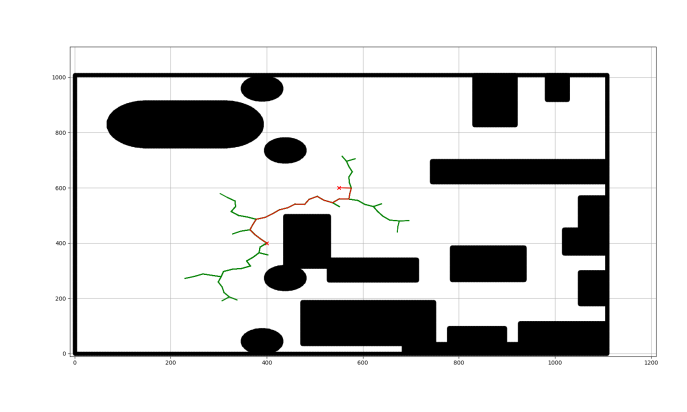
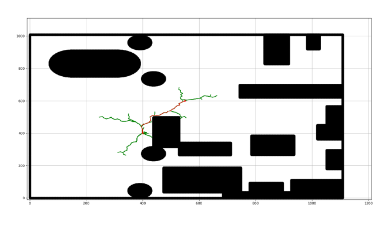

# Motion_Planning_with_RRTstar_and_InformedRRTstar
Implementation of RRT* and Informed-RRT* on Turtlebot in ROS-Gazebo


## 1 Overview and Instructions:

### 1.1 Overview:

This repository contains motion planning algorithms such as RRT, RRT* and Informed RRT* implemented on an autonomous robot in ROS and Gazebo.

The repository contains following files:
- ```rrt.py```                - Python Script for RRT algorithm
- ```rrt_star.py```           - Python Script for RRT* algorithm
- ```informed_rrtstar.py```   - Python Script for InformedRRT* algorithm
- ```FinalReport.pdf```       - Project report explaining the pseudocode for each algorithm as well as their performance results. 
- ```output_video.mkv```      - Sample output video, showing simulation in Gazebo, using ROS.


## 1.2 Instructions to run the code:

Clone the repository into a new folder of your choice.

``` cd <your_directory>```

``` git clone https://github.com/nakul3112/Motion_Planning_with_RRTstar_and_InformedRRTstar.git ```

At this stage, there is one python script each for RRT, RRT* and INformed-RRT*. Run the .py file using following command:
 
``` python3 informed_rrtstar.py```


## 1.3 Output:


Here is the visualization of the random node exploration by each of the algorithm(shown in green) and the final path between start node and end node(shown in red).

1. RRT algorithm:



2. RRT* algorithm:



3. Informed-RRT* algorithm:


### Output Video:

The output video can be accessed here:

[Output videos](https://drive.google.com/drive/folders/1SijcgaZUc7h1AUiRc8O_2eM_aFDR0kZD?usp=sharing)


